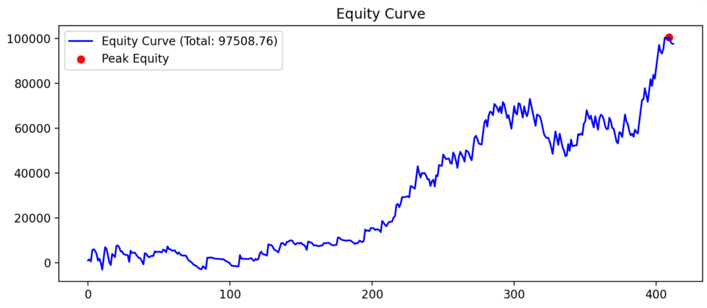
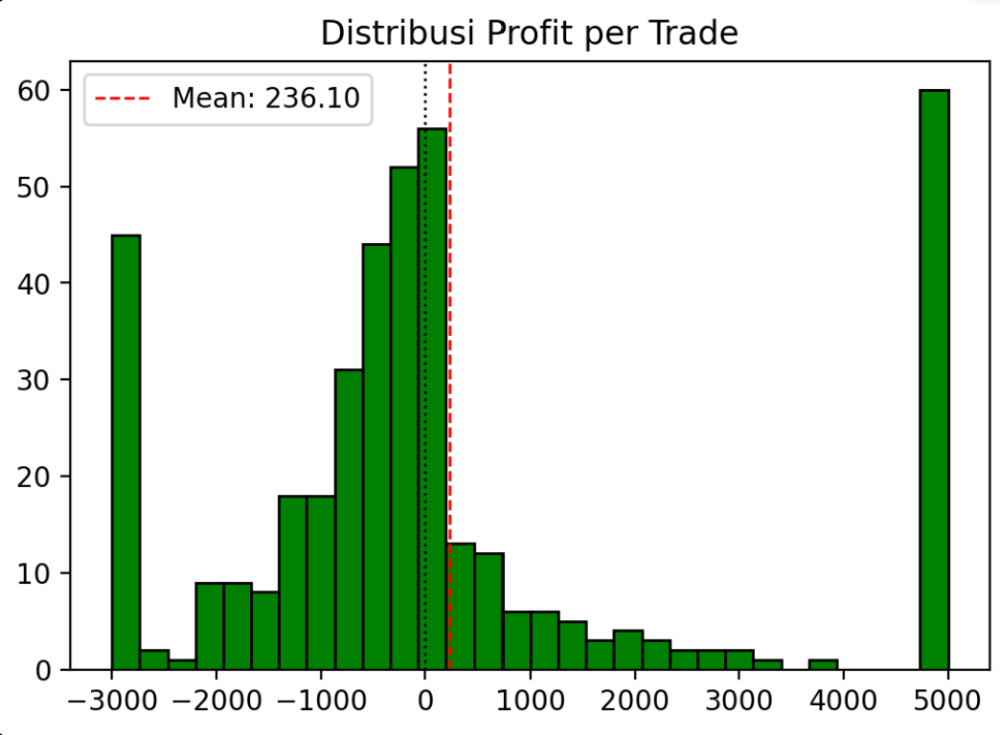
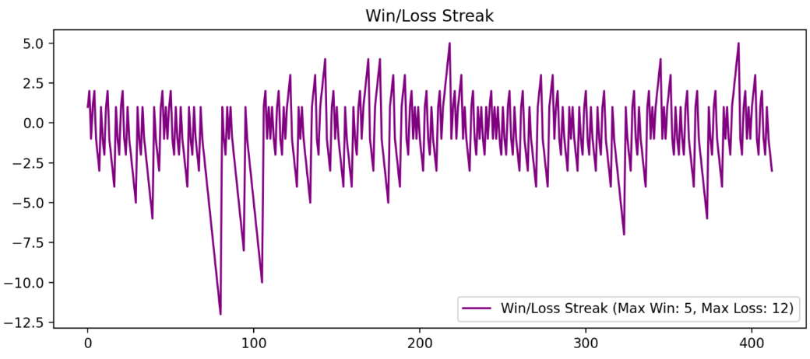
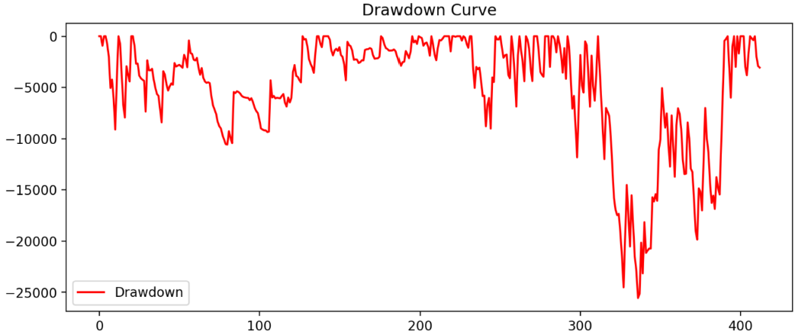

# Backtest BTCUSDT - SMA Crossover

Proyek ini adalah aplikasi **Streamlit** untuk melakukan backtest strategi **Simple Moving Average (SMA) crossover** pada pasangan BTCUSDT dengan data timeframe H1 (2022–2025).  
Aplikasi ini menampilkan **log sinyal trading**, **visualisasi performa dalam tab interaktif**, serta **analisa otomatis** (profit, win rate, Sharpe ratio).

---

## Fitur Utama
- Input parameter fleksibel (SMA Fast, SMA Slow, TP, SL, Tick Size).
- Log sinyal trading lengkap (Golden Cross, Death Cross, TP/SL, Exit).
- Visualisasi interaktif dalam tab:
  - Equity Curve
  - Histogram Profit
  - Win/Loss Streak
  - Drawdown Curve
- Analisa otomatis:
  - Total Profit
  - Win Rate
  - Sharpe Ratio
  - Interpretasi strategi

---

## Penjelasan Strategi
- **SMA Fast**: rata-rata harga jangka pendek, lebih sensitif terhadap perubahan harga.
- **SMA Slow**: rata-rata harga jangka panjang, lebih halus dan menunjukkan tren utama.
- **Golden Cross**: SMA Fast menembus ke atas SMA Slow → sinyal bullish (BUY).
- **Death Cross**: SMA Fast menembus ke bawah SMA Slow → sinyal bearish (SELL).

Strategi ini efektif untuk menangkap tren besar, tetapi bisa menghasilkan sinyal palsu saat pasar sideways.

---

## Cara Menjalankan
1. Clone repository:
   ```bash
   git clone https://github.com/HilmiSamdya/btc-sma-backtest.git
   cd btc-sma-backtest
2. Install dependencies:
   ```bash
   pip install -r requirements.txt
4. Jalankan Aplikasi:
   ```bash
   streamlit run app.py

## Contoh Hasil Backtest

- **Jumlah trade**: 460  
- **Total Profit**: 97,508.76  
- **Win Rate**: 39.47%  
- **Sharpe Ratio**: 0.10  

 **Interpretasi:**
- Strategi SMA crossover cocok untuk tren panjang (bull run BTC).
- Kelemahan: di kondisi sideways muncul banyak sinyal palsu.
- Dengan RR sekitar **1.67**, strategi ini cukup sehat karena TP lebih besar dari SL.

## 📈 Visualisasi Hasil Backtest

### Equity Curve


### Histogram Profit


### Win/Loss Streak


### Drawdown Curve



