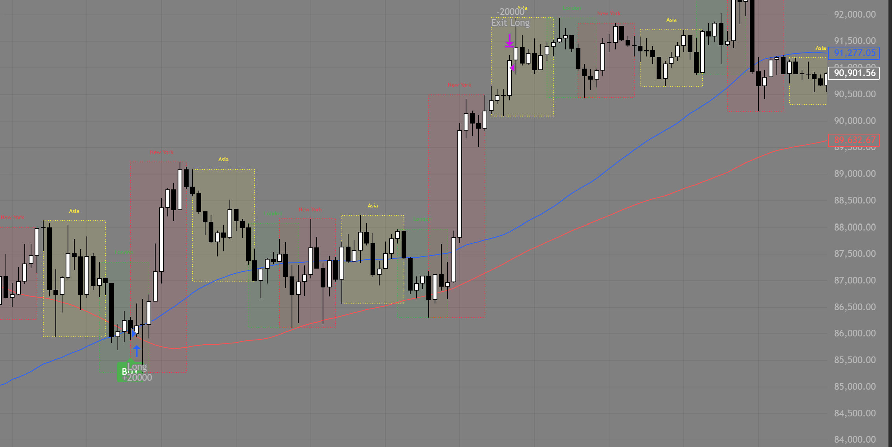
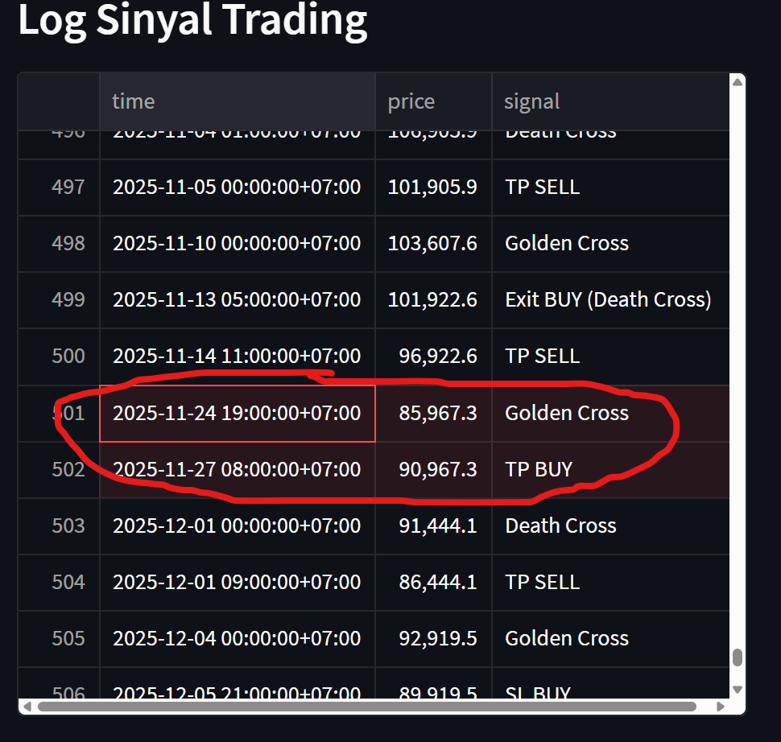

# Backtest BTCUSDT - SMA Crossover

Proyek ini adalah aplikasi **Streamlit** untuk melakukan backtest strategi **Simple Moving Average (SMA) crossover** pada pasangan BTCUSDT dengan data timeframe H1 (2022–2025).  
Aplikasi ini menampilkan **log sinyal trading**, **visualisasi performa dalam tab interaktif**, serta **analisa otomatis** (profit, win rate, Sharpe ratio).
**Live Demo:** [Coba di sini](https://btc-sma-backtest-qimupig9ibiv6itfxh9xth.streamlit.app/)

---

## Fitur Utama
- Input parameter fleksibel (SMA Fast, SMA Slow, TP, SL, Tick Size).
- Log sinyal trading lengkap (Golden Cross, Death Cross, TP/SL, Exit).
- Visualisasi interaktif dalam tab:
  - Equity Curve
  - Histogram Profit
  - Win/Loss Streak
  - Drawdown Curve
- Analisa otomatis:
  - Total Profit
  - Win Rate
  - Sharpe Ratio
  - Interpretasi strategi

---
## Visualisasi TradingView + Log Streamlit

### TradingView Chart (Pine Script)

**Keterangan:**
- Garis **SMA Fast** ditampilkan dengan warna **biru**.
- Garis **SMA Slow** ditampilkan dengan warna **merah**.
- Golden Cross terjadi saat garis biru menembus ke atas garis merah → sinyal BUY.
- Death Cross terjadi saat garis biru menembus ke bawah garis merah → sinyal SELL.

### Log Trading dari Streamlit

**Keterangan:**
- Log Streamlit mencatat eksekusi sinyal (BUY/SELL, TP/SL, Exit).
- Kombinasi chart TradingView dan log Streamlit memudahkan verifikasi bahwa hasil backtest Python konsisten dengan chart TradingView.
  
## Penjelasan Strategi
- **SMA Fast**: rata-rata harga jangka pendek, lebih sensitif terhadap perubahan harga.
- **SMA Slow**: rata-rata harga jangka panjang, lebih halus dan menunjukkan tren utama.
- **Golden Cross**: SMA Fast menembus ke atas SMA Slow → sinyal bullish (BUY).
- **Death Cross**: SMA Fast menembus ke bawah SMA Slow → sinyal bearish (SELL).

Strategi ini efektif untuk menangkap tren besar, tetapi bisa menghasilkan sinyal palsu saat pasar sideways.

---

## Contoh Hasil Backtest

- **Jumlah trade**: 460  
- **Total Profit**: 97,508.76  
- **Win Rate**: 39.47%  
- **Sharpe Ratio**: 0.10  

 **Interpretasi:**
- Strategi SMA crossover cocok untuk tren panjang (bull run BTC).
- Kelemahan: di kondisi sideways muncul banyak sinyal palsu.
- Dengan RR sekitar **1.67**, strategi ini cukup sehat karena TP lebih besar dari SL.

## Visualisasi Hasil Backtest

### Equity Curve

### Histogram Profit

### Win/Loss Streak

### Drawdown Curve

